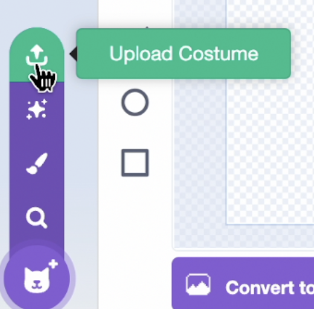
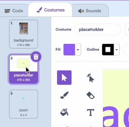

## Add a background

<html>
<div style="position: relative; overflow: hidden; padding-top: 56.25%;">
<iframe style="position: absolute; top: 0; left: 0; right: 0; width: 100%; height: 100%; border: none;" src="https://www.youtube.com/embed/AmGDPOSfvFQ?rel=0&cc_load_policy=1" allowfullscreen allow="accelerometer; autoplay; clipboard-write; encrypted-media; gyroscope; picture-in-picture; web-share">
</iframe>
</div><br>
</html>

\--- task ---

Open the Scratch [starter project](http://rpf.io/flatgame){:target="_blank"}

\--- /task ---

\--- task ---

In the 'Upload Costume' area for the background sprite, choose one of your photos. Rename the sprite "background" and drag it to the top of the list of costumes.



\--- /task ---

\--- task ---

Delete the placeholder costume, but make sure you **do not** delete the zoom costume.


\--- /task ---

\--- task ---

Click the purple 'Convert to Vector' button beneath the image editor.


\--- /task ---

\--- task ---

With the select tool, rotate and resize the photo so that it covers the paint area.


\--- /task ---

\--- task ---

In the starter code on your background sprite, change the pull-down menu in the `switch costumes`{:class="block3looks"} block to say background:

```blocks3
when flag clicked
switch costume to (zoom v)
set size to [400]%
+switch costume to (background v)
go to [back v] layer
```

\--- /task ---

This is how we make the background sprite really big!
