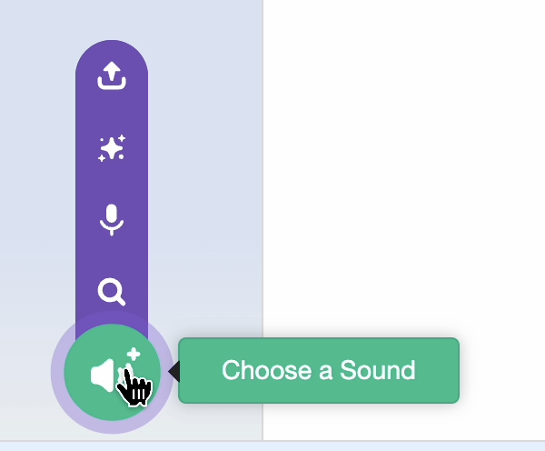
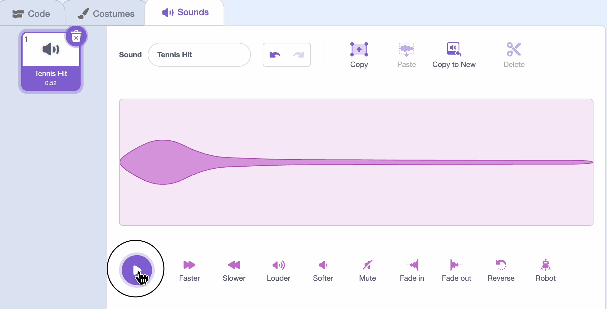

## Add sound

Test out your player and imagine a sound that it could make.

For example, walking background of leaves might make a crunch sound.

\--- task ---

Open the Sounds tab and click 'Choose a sound'.


Hover over the play button to try out sounds until you find one that would work for a walking sound. Shorter sounds work best.

\--- /task ---

\--- task ---

Click on the sound to select it.


\--- /task ---

\--- task ---

Edit the sound to make it softer or faster by clicking the icons in the editor.



\--- /task ---

\--- task ---

Add sound blocks to your code:

```blocks3
when flag clicked
go to [front v] layer
forever
if <key (left arrow v) pressed> then
next costume
+play sound (Wood Tap v) until done
end
if <key (right arrow v) pressed> then
next costume
+play sound (Wood Tap v) until done
end
if <<key (up arrow v) pressed> or <key (up arrow v) pressed >> then
next costume
+play sound (Wood Tap v) until done
end
```

\--- /task ---

\--- task ---

**Test it again** — how does the sound work out? Is the direction okay? If you need to tweak volume or direction, you can go back and change it in your code.

\--- /task ---
